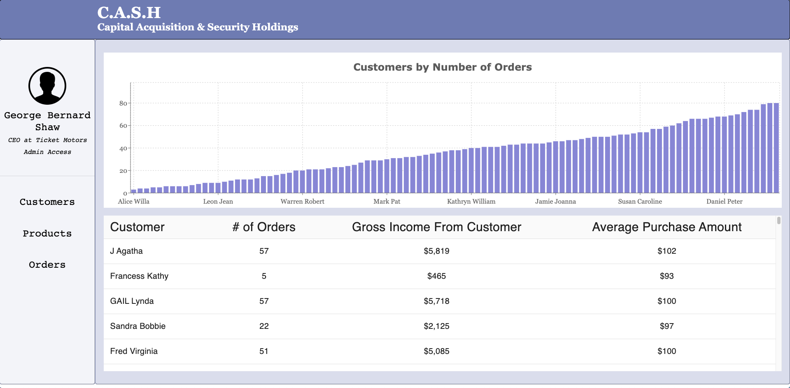
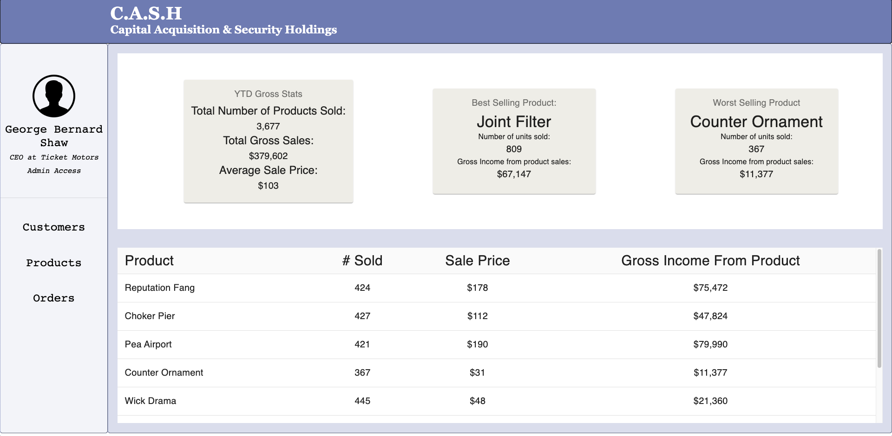
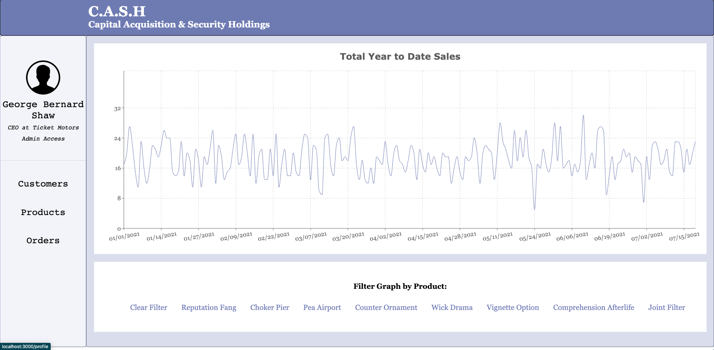
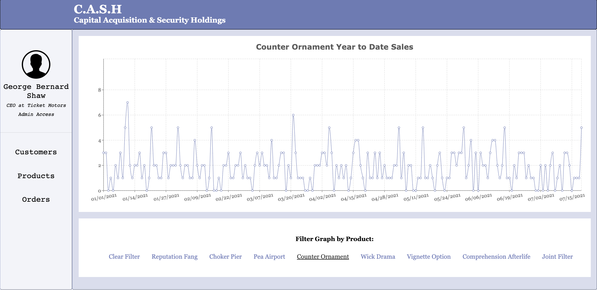
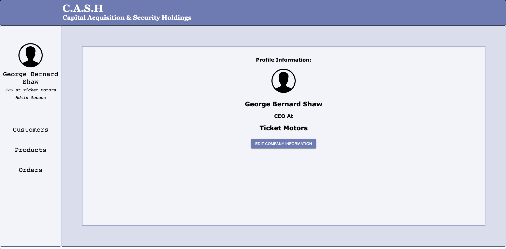
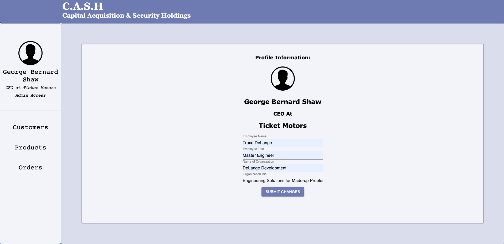
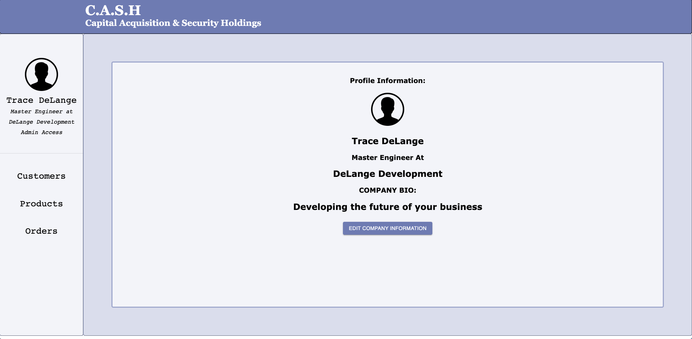

# Smart Sales!

## Welcome to the CASH (Capital Acquisition & Security Holdings) Sales Console.

**Thanks to the latest revolutionary software out of DeLange Development, you can finally access a treasure trove of business analytics associated with fictitious companies, customers, products, and orders that have never (and will never!) exist! Wow!**

## *That sounds awesome! How does it work*?
It is awesome! The CASH sales console works by combining the powerful abilities of **React, Python and JSON-Server** to generate a mock sales report containing (by default), a company with a line of 8 products and 100 loyal customers with anywhere between 1 and 20 orders placed over the last year. Once this report is generated in Python, it is exported in JSON format and passed off to JSON-server, which acts as a backend host for the mock data. Finally, JSON-server allows the front-end react page to not only access the data but present it in a way that allows for the identification of sales trends, customer loyalties and sales statistics. 

# **Console Features**:

The Sales Console contains four main routes to interact with:
- Customer Console
- Product Console
- Order Console
- Profile Page
---
### **Customer Console**

The Customer Console is where you can find information about all your loyal customers. The front-page features of a bar graph of each customer organized by the number of orders placed by the individual. Additionally, there is a table below that features information about each customer such as the number of orders placed, the amount of money spent over each order, and the average amount of money spent on an order. 

If a customer is clicked, a histograph will be displayed featuring the frequency of each product purchased by the customer:

With this tool you can see exactly who your most supportive patrons are as well as their favorite products. It's good to know who your friends are!

 ---
### **Product Console**
The Product Console contains information about specific product sales, such as the best and worst selling products, the number of units sold, and the gross income amassed by each product. Additionally, there is a card that contains overall YTD stats on product sales containing the gross income for the year, overall average sale price and the total number of units sold. 

---
### **Order Console**
The Order Console is where you can find information about sales trends over time. The graph displays year to date information about the total number of sales made on each day. 

Additionally, you can filter the graph to display YTD sales for a specific product by selecting it from the menu below:

We can tell from a glance that Counter Ornaments had a Peak at the beginning of the year... Holidays?

---
### **Profile Page**

By clicking on the username on the sidebar, you can visit the user profile page where you can customize aspects of your account and company. Changes made to the profile page are posted to the JSON-server enabling persistent changes to be made to the company information. 

For example:

Can easily be populated:

And persistently changed:

---

### **Data Generation Features:**

Inside the data-generation directory, you can find the python script used to generate db.json - The script makes use of two txt files that contain the corpus data for the fictional companies. The first is a list of 200,001 author names arrayed in a plain text file. Many of the customers are pulled directly from this list. The product names and the company name are generated using a text file containing a list of 6801 unique nouns. 

Each of these corpus files were downloaded from public repositories and are not the product of my own creation. The access, utilization, mutation, and display of these file contents was the original work of myself. 

# Installation

### Dependencies:
- Python 3.7.4 (If you intend on generating new db's)
- JSON-server (0.16.3)
- npm or Yarn

Given dependencies are correctly installed and up to date, follow the instructions below to download and install the sales-console: 

If you would like to experiment with the CASH Sales-Console yourself, you can download and run the project with the following commands:

First, navigate to a directory in which you'd like to download the project. Then, close the repository like so:

    git clone git@github.com:tracedelange/sales-console.git

Navigate into the directory 

    cd sales-console

Install dependencies

    yarn install
    //OR
    npm install

Start the React App

    yarn start
    //OR
    npm start

In another terminal instance, start the json-server:

    json-server -p 3001 --watch db.json

That should do it!

## **Acknowledgements**

The data generated in this project is entirely fictitious and not meant to represent any legitimate organization, product or individual, it is entirely for the purpose of gaining experience developing a tool and occasionally getting a laugh out of the absurd combinations that pop up.

If you have any comments or questions about this project, you can reach me at tracedelange@me.com

You can also read more about this project at [my blog](https://tracedelange.github.io/)

Thanks for stopping by! 

***Trace***

